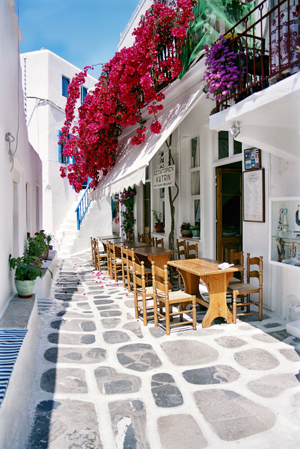
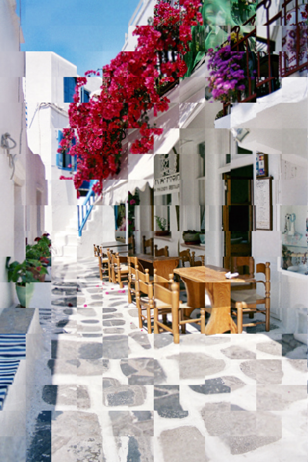
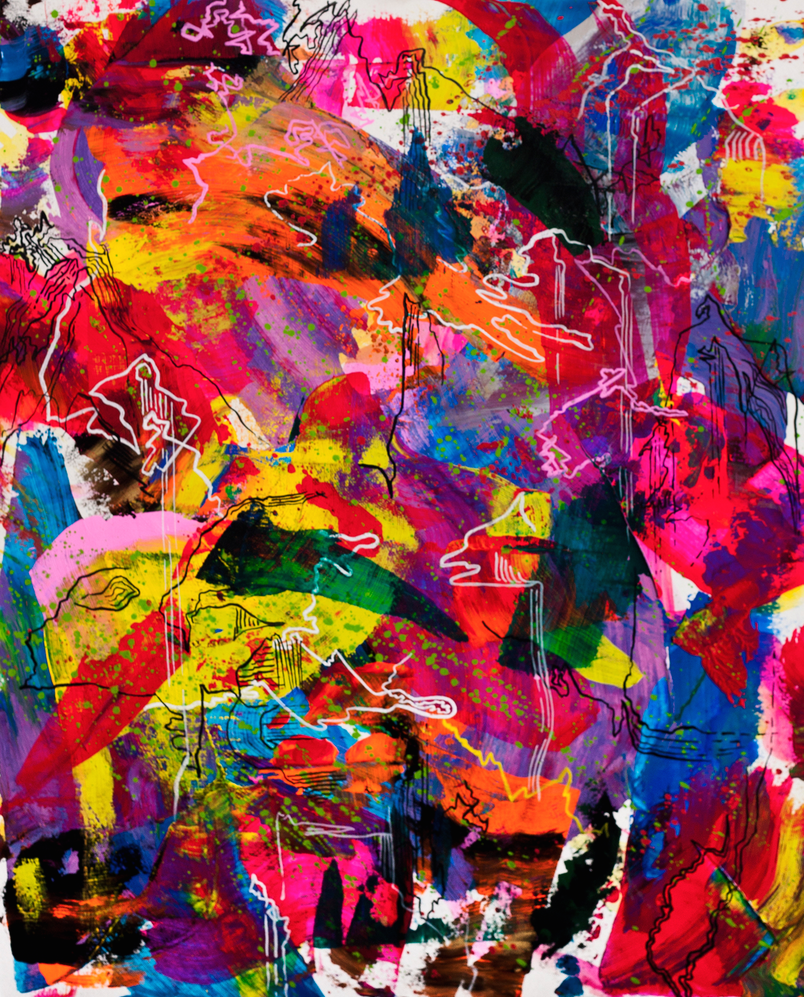
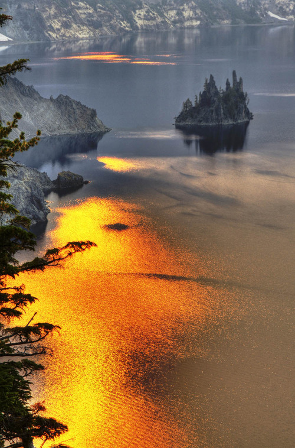

# Image Rezoomer 

Inspired by David Hockney's [multi-camera seasons video
project](https://www.youtube.com/watch?v=yxcaM_f0-kg), this program will take
in a given image, draw a grid on it, and randomly zoom the given segments.

## Installation

This project is built using Haskell; to run use the Haskell [Stack](https://docs.haskellstack.org/en/stable/README/) build
tool:

```
git clone https://github.com/silky/rezoomer.git
cd rezoomer
stack setup
stack install
```

This will install the `rezoomer` binary:

```
> rezoomer --help
rezoom - fun image transformation!

Usage: rezoomer --size INT --inImage STRING --outImage STRING

Available options:
  -h,--help                Show this help text
```

The `size` parameter is the size of the grid in pixels. Try `50` and see how
it looks. The other two parameters are the paths to the image you want to
perform this filter on, and where it should write it's ouput to.


## Examples

|| Greece |
|---------|--------|
| Image   | 
| Zoomed  | 
| Command | `rezoomer --size 50 --inImage images/greeze.jpg --outImage images/greece_out.jpg`


|| Cool Painting |
|---------|--------|
| Image   | 
| GIF     | [Cool Painting as GIF on Imgur](http://i.imgur.com/SSwnnF6.gifv)
| Command | `./makegif images/paint.png`

|| Cool Lake Picture |
|---------|--------|
| Image   | 
| GIF     | [Cool Lake Picture as GIF on Imgur](http://i.imgur.com/EUsXt6C.gifv)
| Command | `./makegif images/lake.jpg`


## Making a GIF

The GIF conversion is done by a series of hacky imagemagick commands. So
first, install [imagemagick](https://www.imagemagick.org/), and then look at
[makegif.sh](makegif.sh).

Basically it:

1. Generates 50 frames of gradually-increasing zoomed pictures
2. Downsamples them to make the GIF smaller
3. Combines them into a GIF.

